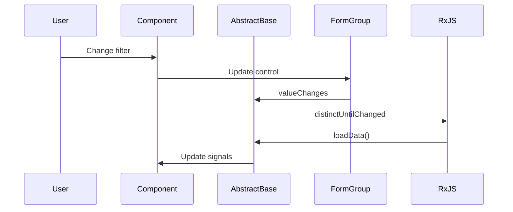
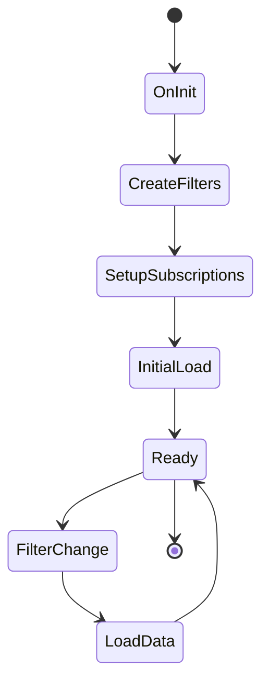

# Architecture Overview

## 🏗️ System Architecture

TAXER is built using modern Angular patterns with a focus on reusability, type safety, and maintainability.

## 📐 Design Patterns

### 1. Abstract Component Pattern

The core architectural pattern is the `FilteredAbstractComponent<D, F>` base class:

```typescript
@Directive()
export abstract class FilteredAbstractComponent<D, F extends Record<string, unknown>>
  implements OnInit
{
  protected filterFormGroup: FormGroup<ControlsOf<F>>;
  protected readonly isLoading = signal<boolean>(false);
  protected readonly data = signal<D>(null);
  
  protected abstract createFilters(): FormGroup<ControlsOf<F>>;
  protected abstract loadData(): Observable<D>;
}
```

**Benefits**:
- ✅ Eliminates code duplication across filtering components
- ✅ Enforces consistent filtering behavior
- ✅ Provides type-safe form handling
- ✅ Centralizes loading state management

### 2. Generic Type System

Strong typing throughout the application:

```typescript
// Type-safe form controls
export type ControlsOf<T> = { [Property in keyof T]: FormControl<T[Property]> };

// Component-specific models
export type StatsFiltersModel = Partial<{
  dateFrom: Date;
  dateTo: Date;
  compareDateFrom: Date;
  compareDateTo: Date;
}>;
```

### 3. Signal-Based State Management

Modern Angular signals for reactive state:

```typescript
protected readonly isLoading = signal<boolean>(false);
protected readonly data = signal<D>(null);
protected isCompareMode = signal<boolean>(false);
```

## 🏢 Component Architecture

```
AppComponent
└── RouterOutlet
    ├── StatsComponent ──┐
    ├── LoggerComponent ─┼── FilteredAbstractComponent<D,F>
    └── PaymentsComponent ┘       ├── FormBuilder
                                  ├── RxJS (debounceTime, switchMap, retry)
                                  ├── Signal State (isLoading, data)
                                  └── ControlsOf<T> Type

Shared:
├── UiToggleGroupSingleDirective → Stats/Logger
└── ControlsOf<T> → All Components
```

## 📦 Module Structure

### Core Modules
- **`app/`** - Root application shell with navigation
- **`modules/`** - Feature modules (stats, logger, payment)
- **`shared/`** - Reusable components, directives, and utilities

### Feature Module Pattern
Each feature module follows consistent structure:
```
modules/[feature]/
├── components/
│   ├── [feature].component.ts
│   ├── [feature].component.html
│   └── [feature].component.scss
```

## 🔄 Data Flow

### 1. Form State Management


### 2. Component Lifecycle


## 🎨 UI Architecture

### Material Design Integration
- Consistent Material components across all modules
- Proper form field integration with validation
- Responsive design patterns
- Accessibility considerations

### Component Communication
- Parent-child via `@Input()` and `@Output()`
- Sibling components via URL state (to be implemented)
- Shared state via abstract base class

## 🔧 Technical Decisions

### 1. Standalone Components
**Decision**: Use Angular 20 standalone components instead of NgModules
**Rationale**: 
- Simpler dependency management
- Better tree-shaking
- Future-proof architecture
- Reduced boilerplate

### 2. OnPush Change Detection
**Decision**: Use `ChangeDetectionStrategy.OnPush` everywhere
**Rationale**:
- Better performance
- Predictable change detection
- Works well with signals and reactive patterns

### 3. Reactive Forms over Template-Driven
**Decision**: Use reactive forms with strong typing
**Rationale**:
- Better TypeScript integration
- More testable
- Consistent validation patterns
- Better control over form state

### 4. Signal-Based State
**Decision**: Use Angular signals for component state
**Rationale**:
- Modern Angular pattern
- Better performance than observables for simple state
- Easier testing and debugging
- Future-proof

## 🚀 Performance Considerations

### Current Optimizations
- OnPush change detection strategy
- Lazy-loaded feature components
- Signal-based reactive updates
- Minimal bundle size with standalone components

### Potential Improvements
- Virtual scrolling for large datasets
- OnPush optimization in list components  
- Service worker for caching
- Bundle analysis and optimization

## 🔒 Type Safety

### Form Type Safety
```typescript
// Ensures form controls match model structure
FormGroup<ControlsOf<StatsFiltersModel>>

// Provides compile-time validation
this.fb.group<ControlsOf<StatsFiltersModel>>({
  dateFrom: this.fb.control<Date>(null, Validators.required),
  dateTo: this.fb.control<Date>(null, Validators.required),
});
```

### Generic Component Safety
```typescript
// Base class enforces proper typing
export class StatsComponent 
  extends FilteredAbstractComponent<StatsModel[], StatsFiltersModel>
```

## 🧪 Testing Architecture

### Component Testing Strategy
- Unit tests for business logic in base class
- Component tests for UI interactions
- Integration tests for form behavior
- E2E tests for user workflows

### Testability Features
- Dependency injection for easy mocking
- Pure functions for data transformation
- Signal-based state for easy assertion
- Consistent component selectors

## 🔮 Future Enhancements

### Planned Improvements
1. **URL State Management** - Router integration for filter persistence
2. **Service Layer** - Proper HTTP services with interceptors
3. **Error Boundaries** - Comprehensive error handling
4. **Internationalization** - Multi-language support
5. **Progressive Web App** - Offline capabilities

### Scalability Considerations
- Feature flag system for gradual rollouts
- Micro-frontend architecture potential
- State management library integration (NgRx/Akita)
- Component library extraction
